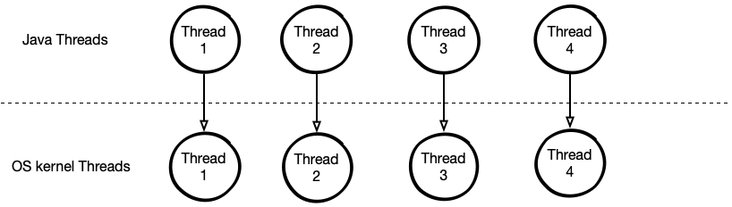
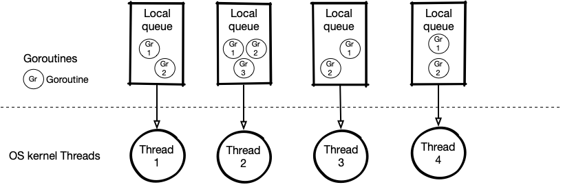
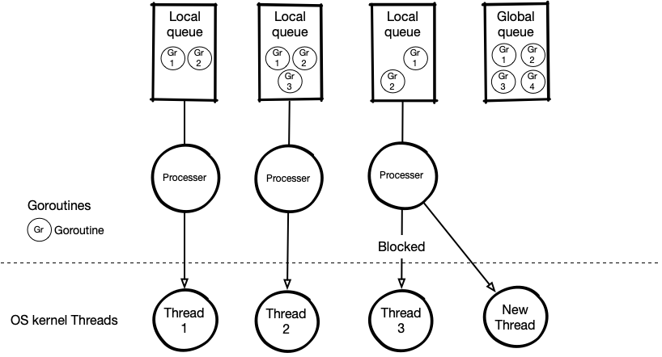

## Java's thread and Golang goroutine
### Java thread
Java use native OS thread. A Thread in java is corresponding with a native OS thread, but Java cannot determinate when thread will be executed.
That is complete under OS thread scheduler control.

Every time Java create a new thread JVM has to allocate stack memory for this thread, so if you create too many threads maybe OutOfStackMemory error
is going to happend. In Java, you can specific size of stack memory of a thread by option **-Xss**.
When you want to improve you Java Application, you can use many threads to increase performance, but because resource bound like CPU, memory bound or
I/O bound like disk or network maybe cause performance down. 
Another operation you should pay attention on is **Context Switch**. When the number of threads is more than number of cores, OS would arrange core to
execute thread as fairs as it can throught scheduler. Because of that OS save current thread's state and load another thread's state to run it.
This is call Context Switch, which is kind of expensive cost operation.

The most common reasons of Context Switch are:
+ the time slice is lapse
+ the thread with higher priority has become ready to run
+ a running thread needs to wait 

### Goroutine
Not like Java Golang does not use native OS thread. Golang implement a lighweight thread concept called **Goroutine** and Golang manage goroutine by it's
scheduler. Ofcourse, all of programming languages use native OS thread to run their application. Golang is not a exception, Golang spead goroutines to a fixed
number of threads. We can specific number of native Os thread will be used by vriable **GOMAXPROCS**. 

The main advantages of goroutine compare to Java thread are a goroutine has smaller size and process switch from one goroutine to another take less time than
Java thread. Golang has it own scheduler, a native thread picks goroutines follow the basic stategy:
+ pick goroutines from local per thread FIFO-queue
+ pick goroutines from global FIFO-queue
+ steal goroutine from other threads (work-stealing)

We were aware that a native thread execute goroutines, so what happend if this thread is blocked by system call whether all goroutines will be stoped or not.
The answer is NO. Golang create processer componets to sperate goroutines with native threads and when a native thread is blokeds, Golang will create a new thread
and move the processer to this thread.

